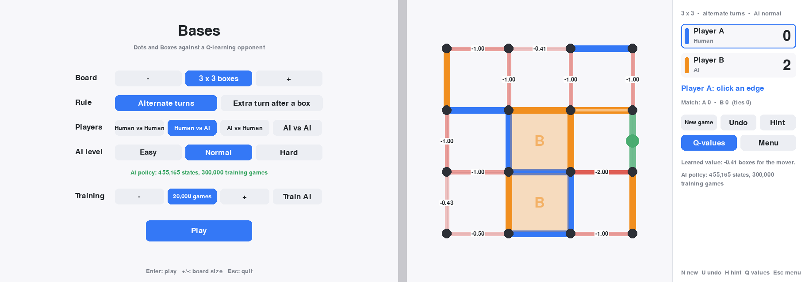
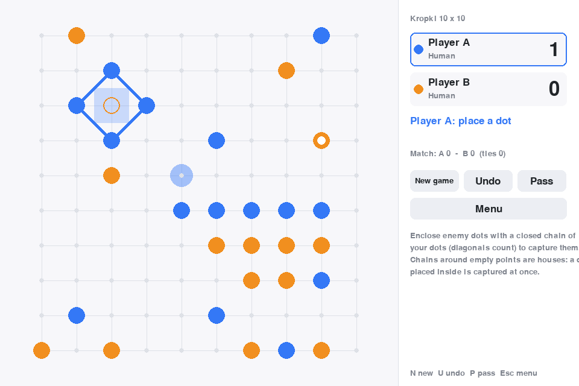

# Bases

[](https://github.com/degen00/bases/actions/workflows/tests.yml)

Bases is two games in one package: Dots and Boxes with a reinforcement-learning opponent, and Kropki, the free-form base game (see below). Players take
turns drawing lines between adjacent dots; whoever draws the fourth side of a
box owns it, and the player with more boxes when the grid is full wins.

By default Bases plays the *alternating* variant: completing a box does **not**
grant another move. The classic rule (extra turn after a box) is available as an
option in both the GUI and the CLI.

The AI is a tabular Q-learning agent that learns by playing against itself.
You can play it in a graphical window, train it from the GUI or the command
line, tune its hyperparameters, and inspect what it has learned through a
Q-value overlay.

## Quick start

```bash
python3 -m venv .venv && source .venv/bin/activate
pip install -r requirements.txt       # pyyaml, pygame
python play.py                        # opens the GUI (Human vs AI, 3x3)
```

Or install it as a package: `pip install -e .` then run `bases`.

Trained policies for 2x2 and 3x3 boards ship in `data/policy/`. For other
sizes the AI plays a greedy heuristic until you train it (menu → *Train AI*).

## Playing in the GUI



* **Board**: `-` / `+` choose 1x1 to 8x8 boxes.
* **Rule**: *Alternate turns* (Bases) or *Extra turn after a box* (classic).
* **Players**: Human vs Human, Human vs AI, AI vs Human, AI vs AI.
* **AI level**: *Easy* makes a random move a third of the time, *Normal* plays
  the Q-table, *Hard* adds a 3-ply search (2-ply on boards above 3x3) that uses
  the table as leaf evaluation.
* **Train AI**: trains a policy for the selected size and rule in the
  background, with a progress bar and live win rates. *Stop early* keeps
  what has been learned so far.
* In a game: hover an edge and click to draw it. `N` new game, `U` undo (in
  Human-vs-AI it takes back the AI's reply too), `H` hint (highlights the move
  the Hard AI would play for you), `Q` shows the AI's Q-value for every free
  edge (green = good for the mover, red = bad), `Esc` menu.

## Kropki: free-form bases

The second game in the package is the one Bases is named after: players
alternately place a dot of their colour on a grid point, and a closed chain of
your dots (orthogonal **or diagonal** steps) around one or more enemy dots
captures them and turns the enclosed region into your *base*. Chains around
empty points are only *houses*: not a base, but an enemy dot placed inside one
is captured immediately. The board edge never counts as part of a chain. The
game ends when no playable point is left or both players pass in a row; the
player with more captured dots wins. This is the classic Polish/Russian game
Kropki (Točki).

* GUI: choose **Kropki** in the *Game* row of the menu (6x6 to 20x20 points);
  click a point to place a dot, `P` to pass, `U` undo, `N` new game.
* Terminal: `python play.py kropki -W 10 -m hva --difficulty hard`, entering
  moves as `x y`, or `pass`, `undo`, `quit`.
* Rule variants are constructor flags of `KropkiBoard`: `mover_priority`
  (when a move closes chains for both sides, the mover captures first) and
  `allow_pass`.

The Kropki AI (`bases/kropki_ai.py`) does not use Q-learning: a 10x10 board
has about 3^100 positions and no symmetry trick makes a table feasible. It is
a search player instead. Every legal move is scored by captures, dots saved
from an enemy capture, self-capture avoidance, Go-style *liberty pressure*
(an orthogonally connected group is captured exactly when all its orthogonal
liberties hold enemy dots, so reducing liberties of interior groups, putting
them in atari, and escaping with your own endangered groups all count) and
position. Hard and Expert run an iterative-deepening alpha-beta search over
the best candidates (liberty-based move ordering, a transposition table, a
threat- and danger-aware leaf) within a time budget of 0.5 s and 2 s per
move. Easy adds random moves. Captures, threats and house points are found
exactly by an articulation-point analysis of the open-point graph
(`capture_map`), so the search needs no trial plays. Level ordering is
checked with the tournament harness below; on 8x8 with six games per pair
(colours alternating, seed 5):

| Pair | Result for the first | Avg margin |
|---|---|---|
| Normal vs Random | 4-0-0 | +9.2 |
| Hard vs Normal | 4-2-0 | +3.3 |
| Expert vs Normal | 3-0-3 | +3.0 |
| Expert vs Hard | 3-1-2 | +0.2 |



Developer tools for Kropki:

* `python play.py kropki-eval --levels random,normal,hard,expert --games 4 --width 8`
  plays seeded self-play matches between levels (colours alternate) and
  reports win rates, margins and ms per move. Use it after changing weights.
* `python tools/export_vectors.py` records games as JSON conformance vectors
  (`data/vectors/kropki_vectors.json`); `--verify FILE` replays them. Any port
  of the engine must reproduce every capture and score in that file.
* Boards need not be square: the GUI offers up to the classic 39x32, the CLI
  takes `--points 39x32` / `-W 39 -H 32`.

## Command line

```bash
python play.py --help
python play.py train --size 3 --episodes 200000        # self-play training
python play.py train --size 3 --resume --episodes 50000 # continue training
python play.py eval  --size 3 --episodes 500            # vs random, greedy, minimax
python play.py eval  --size 3 --depth 3 --opponent minimax --minimax-depth 2
python play.py tune  --size 3 --trials 10 --train-episodes 20000
python play.py play  --size 3 --mode hva --difficulty hard   # terminal game
python play.py gui   --size 4 --extra-turn
```

`python -m bases ...` works too when run from this directory. Every command
accepts `--extra-turn` / `--no-extra-turn` to override the configured rule.

### Terminal play

Dots are addressed as `x y` with `(0, 0)` top-left, `x` the column and `y` the
row. A move is `x1 y1 x2 y2` for two adjacent dots, e.g. `0 0 1 0`.

```
-------------
*---*   *   *
|            
*   *   *   *
             
*   *   *   *
             
*   *   *   *
-------------
Player B, enter your move (e.g. '0 0 1 0'):
```

## Configuration (`bases.yml`)

```yaml
paths:
  policy: data/policy/policy_{size}x{size}.json.gz
  training_log: data/logs/training_{size}x{size}.csv
  lines_log: data/logs/lines.csv
  game_log: data/logs/game.log
  tuning_results: data/hp/hyperparameter_results_{size}x{size}.csv
rules:
  extra_turn_on_box: false
training:
  default: {learning_rate: 0.3, discount_factor: 0.98, exploration_rate: 0.3,
            exploration_min: 0.02, opponent_mix: {self: 0.8, greedy: 0.1, random: 0.1}}
  3: {...}            # per-size overrides
```

The file is found via `$BASES_CONFIG`, then `./bases.yml`, then the copy next
to the package. Relative paths are resolved against the file's directory.

Outputs:

| File | Content |
|------|---------|
| `data/policy/policy_NxN.json.gz` | Q-table plus metadata (size, rule, episodes, hyperparameters) |
| `data/logs/training_NxN.csv` | learning curve: win rates vs random/greedy at each checkpoint |
| `data/hp/hyperparameter_results_NxN.csv` | one row per tuning trial |
| `data/logs/lines.csv`, `game.log` | move log and event log of terminal games |

## How the AI works

`bases/agent.py` — `QLearningAgent`

* **State** = the set of drawn lines as a bitmask, reduced by the 8 symmetries
  of the square (`Geometry.canonical`). Box ownership is deliberately *not*
  part of the state: the value of a position for the player to move depends
  only on which lines are drawn.
* **Reward** = boxes captured by a move. Summed over a game this equals the
  final box margin, so no separate win/loss reward is needed.
* **Target** (two-player Q-learning / negamax):
  `Q(s,a) ← Q(s,a) + α [ r + γ·V(s') − Q(s,a) ]` with
  `V(s') = max_a' Q(s',a')` if the same player moves again (extra-turn rule)
  and `V(s') = −max_a' Q(s',a')` when the opponent moves next. Both sides of a
  self-play game therefore share one table.
* **Prior**: an unseen `(state, action)` starts at *boxes completed − boxes
  handed over as a third side* rather than 0, so an untrained agent already
  plays like the greedy heuristic and learning refines from there.
* **Backward replay**: each episode's updates are applied newest-first when
  the game ends, so the outcome propagates through the whole game at once.
* **Exploration**: ε-greedy with ε decaying exponentially from
  `exploration_rate` to `exploration_min` over the first 80% of training.
* **Opponents**: `opponent_mix` plays a share of episodes against the greedy
  and random agents (`bases/train.py`), and their moves are learned from too.
* At play time ties are broken by the heuristic, and an unseen position (large
  boards) is played by the prior alone. With `search_depth` > 0 the agent runs
  a negamax search (`bases/search.py`, alpha-beta) with the table as leaf
  evaluation; `noise` adds random moves for easier levels.
* `MinimaxAgent` (prior-based search, default depth 2) is the strongest fixed
  benchmark; `evaluate` and `play.py eval` report results against it.

Tabular learning is exact but does not generalise: 2x2 (12 lines) is solved
within a few thousand games (it matches an exact minimax solver). The shipped
3x3 policy (300,000 games, ~455k states, about 3.5 minutes of training) wins
99.7% against random, ~69% against the greedy heuristic and ~60-70% against a
depth-2 minimax; the Hard level (3-ply search on top) adds a few points. A
depth-2 prior-only search with no learning already beats greedy about as often,
so minimax is the benchmark to watch. 4x4+ mostly relies on the prior outside
the opening and the endgame.

Tried and not adopted: a visit-count learning rate (`α/(1+n)^0.7`) scored no
better than a constant α on 3x3.

## Package layout

```
play.py              entry point (argparse; no arguments → GUI)
bases.yml            configuration
bases/
  board.py           Board (bitmask engine, undo, ASCII render) and Geometry
                     (line indexing, box adjacency, symmetry permutations, prior)
  game.py            Bases: match loop, win tally, CSV/logging
  agent.py           RandomAgent, GreedyAgent, QLearningAgent (+ save/load)
  player.py          HumanPlayer for the terminal
  train.py           train_agents, evaluate, hyperparameter_tuning
  search.py          negamax with alpha-beta (Hard level, hints, MinimaxAgent)
  kropki.py          KropkiBoard: free-form base game rules, undo, ASCII render
  kropki_ai.py       Kropki computer players (random, heuristic, time-budgeted search)
  kropki_tournament.py  self-play matches between Kropki levels
  gui_kropki.py      Kropki scene of the GUI
tools/export_vectors.py  conformance vectors for engine ports
.github/workflows/   CI: unit tests and vector replay on every push and PR
ROADMAP.md           what comes next
  gui.py             pygame interface
  cli.py             command-line interface
  config.py          config discovery and defaults
tests/               unittest suite (python -m unittest discover -s tests)
pyproject.toml       packaging; `pip install -e .` provides the `bases` command
```

Any object with `choose_index(board) -> int` (or the older
`choose_action(board) -> (x1, y1, x2, y2)`) can be a player; objects that
also define `observe(transition)` receive every move they make.

## Development

```bash
python -m unittest discover -s tests -v
SDL_VIDEODRIVER=dummy python -m unittest tests.test_gui   # headless GUI tests
```

## Release log

* **v0.4** — Time-budgeted iterative-deepening search with a transposition
  table (Hard/Expert), self-play tournament harness, conformance vectors for
  engine ports, CI, classic 39x32 boards, roadmap.
* **v0.3** — Kropki, the free-form base game (rules engine with undo and
  rule flags, heuristic/search AI, GUI scene, terminal mode, tests).

* **v0.2** — Bitmask engine (training runs hundreds of games per second), corrected two-player
  Q-learning target, symmetry reduction that also maps actions, heuristic
  prior, backward replay, ε decay, greedy baseline, in-training evaluation,
  gzip policies with metadata, pygame GUI with undo/hint/Q-overlay/difficulty
  levels/in-app training, negamax search and minimax benchmark, argparse CLI,
  packaging, test suite.
* **v0.1** — Initial text-terminal release.
